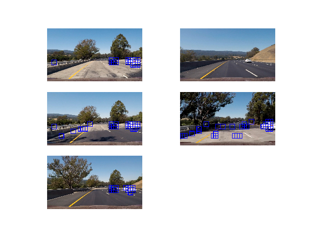
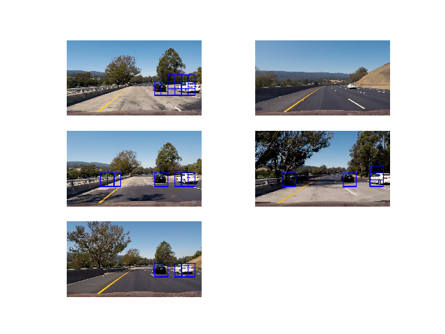
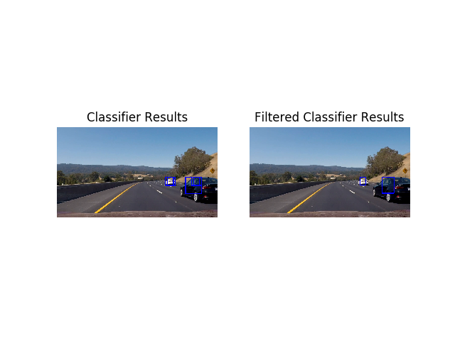

# Project 5--Vechicle Detection and Tracking

# *Rubic Points*
## The goals / steps of this project are the following:
* Perform a Histogram of Oriented Gradients (HOG) feature extraction on a labeled training set of images and train a classifier Linear SVM classifier.
* Optionally, you can also apply a color transform and append binned color features, as well as histograms of color, to your HOG feature vector.
* Note: for those first two steps don't forget to normalize your features and randomize a selection for training and testing.
* Implement a sliding-window technique and use your trained classifier to search for vehicles in images.
* Run your pipeline on a video stream (start with the test_video.mp4 and later implement on full project_video.mp4) and create a heat map of recurring detections frame by frame to reject outliers and follow detected vehicles.
* Estimate a bounding box for vehicles detected.

---

## Detection Features
Three distinct feature types were used for defining the car attributes.  Those features were a Histogram of Oriented Gradients, image color bins and image spatial binning.  The details of implementation each of these feature types is described in the following sections.
### Histogram of Oriented Gradients (HOG)
The OpenCV HOG implementation was used for this project.  This implementation was chosen because it was claimed to execute faster than the scikit-image implementation of the HOG routine. Unfortunately, the openCV implementation does not provide a way to visualize the HOG results.  The HOG module requires several inputs (win_size, block_size, block_stride, cell_size and nbins).  The win_size was taken to equal the training image size (64x64).  The remaining inputs were varied to attempt to find a set of values that would "represent" the car image while keeping the number of HOG values to a minimum.  A good balance between these values seemed to be block_size equal to (16, 16), block_stride equal to (8, 8), cell_size equal to (4, 4) and nbins equal to 11.  An example image of the HOG for this set of parameters is shown in Figure 1 for one of the car training images.  Similarly, Figure 2 illustrates the HOG results for a non-car training image. It should be noted that the scikit-image HOG implementation was used to visualize the results shown below.

The images were converted from an RGB color space to a YUV color space then each of the channels were processed independently by the HOG routine as illustrated in Figures 1 and 2.  The YUV color space was chosen based on suggested provided on the UDACITY Forums.

Figure 1: Illustration of the HOG results for a car training image.  The illustration shows the results for each YUV color channel of the input image.

Figure 2: Illustration of the HOG results for a noncar training image.  The illustration shows the results for each YUV color channel of the input image.

The HOG results for each color channel were appended to for a single vector representing the image descriptor.
### Color Binning
The HOG image descriptors were augmented with a histogram of the color bins for each of the YUV color channels.  Thirty-two (32) histogram bins were used to represent each of the color channels.  Figure 3 illustrates the histograms for one car training image.

Figure 3: Illustration of the color histogram for on of the car training images.
### Spatial Binning
Finally, the image descriptor was also augmented with spatial binning.  Here the image was reduced to 16 by 16 pixels then the reduced image was vectorized to obtain the spatial representation of the image.
## Classifier Training
A separate python script was created for the purpose of [training](train_classifierCV2.py) the classifier.  The classifier was trained using the car and noncar training sets provided by UDACITY.  These training sets consisted of a total of 8862 positive (car) images and 8862 negative (non-car) images.  Each image was read by the training script and, if necessary, scaled to a range of 0 to 255 and converted to an uint8 data type.  The descriptors of each image were then extracted using the HOG, color binning, and spatial binning methods described above.  Finally the cohort was shifted to a mean of zero and normalized using the sklearn StandardScaler and Transform routines. (It should be noted that the car and non-car image sets were randomly shuffled prior to the extraction process to minimize any bias that may exist in the image dataset sequences.)

The classifier was then trained using the openCV SVM routines.  (The openCV routines were chosen over the sklearn SVM routines because the openCV SVM prediction was about four times faster than the sklearn predictor.)  The classifier was trained using the linear option as it was a much faster predictor then RBF, for example, and nearly as accurate.  The training was performed on a 80/20 split of the image dataset with 80% used for training and 20% used for prediction accuracy evaluation.  Finally, the SVM was trained.  Note, C parameter (hyperplane separator) was parametrically adjusted to maximize the SVM prediction accuracy.

At the end of the training, all the parameters (image descriptor and SVM parameters) were saved to a pickle file.  The data in this file was then available to the python script for vehicle detection.

---

## Sliding Window Search
The script for [vehicle detection](./FIndLanesAndCars.py) scanned the image from left to right top to bottom using a sliding window.  For each window, the image descriptors were extracted and then a class (1 for car and 0 for non-car) was predicted using the trained SVM classifier.  Sliding windows were stepped across the image in 16x16 pixel increments (winStride) with each window equal to the training image window size of 64x64 pixels.  The window striding started at row 400 and proceeded to the bottom of the image (row 720).  The upper portion of the image (rows 0 to 399) were not processed since it could be reasonable assumed that no cars would be in the upper portion of the image.  Finally, it should be noted that the widow scale changed from 1 to 2 at row 464.  This was done for two reasons; one, to reduce the number of image windows that had to be classified and two, because the car features became larger toward the lower portion of the image.

Figures 4 and 5 illustrate the effect of image scaling (scales 1 verses 2) on the classification of the sliding windows.  The displayed bounding boxes (blue boxes) are those windows that are classified as containing a car.

Figure 4: Sliding window scale 1.

Figure 5: Sliding window scale 2.

Note the extra false positives with scale 1 as the sliding window approaches the bottom of the image.  This is another justification for switching scales as the sliding window approaches the lower portion of the image.

A number of tests were conducted varying the window stride and the row to switch the scale.  The objective was to maximize the car detection while minimizing the time required to process and image.  The values cited above represented the "best" choice between speed and maximizing the car detection.

## Classifier Optimization
The classifier optimization was described in section on classifier training.  Briefly, the primary method for classifier optimization was determine the best value of C.  This trained classifier was then used to predict the presence in every 100th frame of the test video (project_video.mp4).  For each window classified as a car, the image of that window was written to a file.  These files were then manually viewed and sorted as car or non-car and added to the training data set.  Thus, a hard mining method was adopted to augment the training dataset.  A new SVM classifier was then trained using the augmented dataset which improved the prediction performance of the classifier.  The table below shows the precision and recall of this final trained classifier.

| class | precision | recall | f1-score | support |
| :---: | :---: | :---: | :---: | :---: |
| 0 | 0.98 | 0.99 | 0.98 | 1744 |
| 1 | 0.99 | 0.98 | 0.98 | 1801 |
| avg / total | 0.98 | 0.98 | 0.98 | 3545 |  

Augmenting the training set improved the robustness of the classifier; that is fewer false positives, compared to the classifier trained without mined data.  However, even with the augmented dataset there are still instances of false positives and some frames where no car has been detected.  Additional hard mining could improve this further but then the classifier would become overtrained for the cars and road conditions of the video which would not be an ideal situation.

An example of the sliding window and classifier results is illustrated in Figure 6.  This figure shows the classification results for a single video frame (left figure).  Each box represents a sliding window that was classified as a car.  The right figure illustrates the filtered classifier results.  The filtering methodology is described in detail in the following section.

Figure 6: Illustration of the raw and filtered classification results.

---

## Video Implementation

The project video was processed and saved according to the steps outlined above.  The [final result](./lane_and_car_finding_video.mp4) can be viewed to confirm how successful the car(s) are detected with minimal false positives.  A blue bounding box is used to represent the presence of a detected car.  It should be noted that the video implementation included the lane finding methods from Project 4.  Hence the video not only shows the presence of near by cars but also the lane lines the "autonomous" car is driving within.

It was indicated in the previous section that the bounding box shown in the video is a filtered representation of the classification windows for a single frame.  The filtering methodology adopted is as follows. One, heat map is generated of the previous five frames, inclusive of the current frame.  The heat map is then thresholded by five (the number of frames being averaged).  This thresholded heat map is then processed by the scipy label method which generates bounding boxes that represent the bounds of areas in the thresholded heat map that exceed the threshold value.  The labeled bounding boxes are then drawn on the current frame and saved to a movie file.  Even with the filtering, some false positives are still shown in the movie. Filtering more aggressively would reduce the false positive incidents but it was found that aggressive filtering results in more frequent frames of false negatives.

---

## Discussion
The issues with the current pipeline implementation are two fold.  One the heat map filtering is not very robust; that is, slight shifts in either the number of frames to average or the threshold value yield large changes in the false positive/negative rates.  Decreasing the sliding window step improves the robustness but at a significant cost to the speed of the detection algorithm.  A second issue with the pipeline is the classifier.  Many of the images used to train the classifier are highly pixelated which results in a poor HOG descriptor.  The classifier and hence the pipeline predictions could be improved with a set of training images which are less pixelated.

Potential sources of breakdown are driving up or down hills and on-coming traffic.  Hills are an issue because the pipeline only process the lower half of the camera image.  However, when approaching the bottom or top a a fill, near by cars would be above this horizon and hence would not be detected.  In the case of on-coming traffic, the classifier was trained with side and rear views of cars so likely that on-coming cars would be be correctly classified.

Lastly, openCV 3 has a SVM multi-scale (cascade) classifier that uses HAAR wavelets rather than HOG.  It is claimed that this classifier is robust and fast.  A future project is to test this method to determine if the claims of speed and robustness can be supported.
